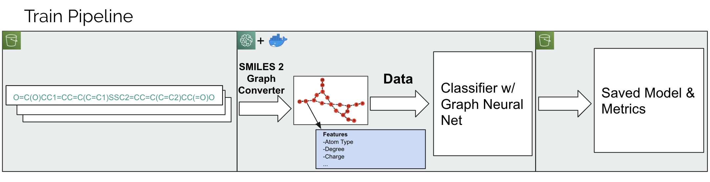

# Drug Prediction
Implementation of graph neural networks for the [HIV MoleculeNet dataset](http://moleculenet.ai/datasets-1). This package is meant to be run as an AWS Sagemaker training job.
For converting the trained model to a Sagemaker endpoint refer to this repo [here](https://github.com/jdurago/drug_prediction_gnn_inference)

# Main Idea
Convert a set of compounds which are encoded as SMILES strings to a graph and feature matrix and use a graph-neural-net to classify drug effectiveness. This training pipeline is implemented with AWS Sagemaker which pulls the training data from an S3 bucket and the subsequently trained model is then stored into a separate S3 bucket.

# Presentation Slides
Further details regarding the motivation, methods and results of implementing this idea can be found in my presentation [here](https://docs.google.com/presentation/d/1M8yiD67klNkfq8BZ3lYRF-SbGC_ZTVFQEpCPge0nEu4/edit?usp=sharing)

# Build Model and Train
Sagemaker training jobs utilize docker containers stored in AWS Elastic Container Registry to execute. Code for running a local and container based training jobs can be found in the <b> [run_container.ipynb](run_container.ipynb) </b> notebook

